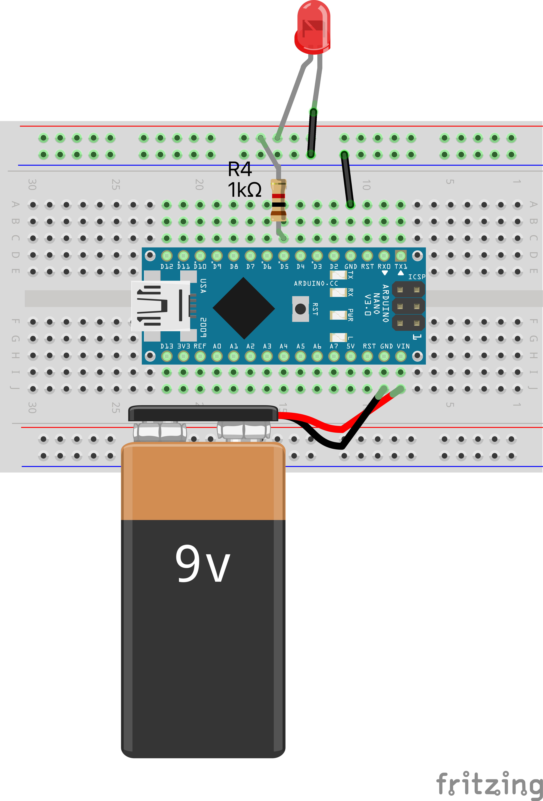
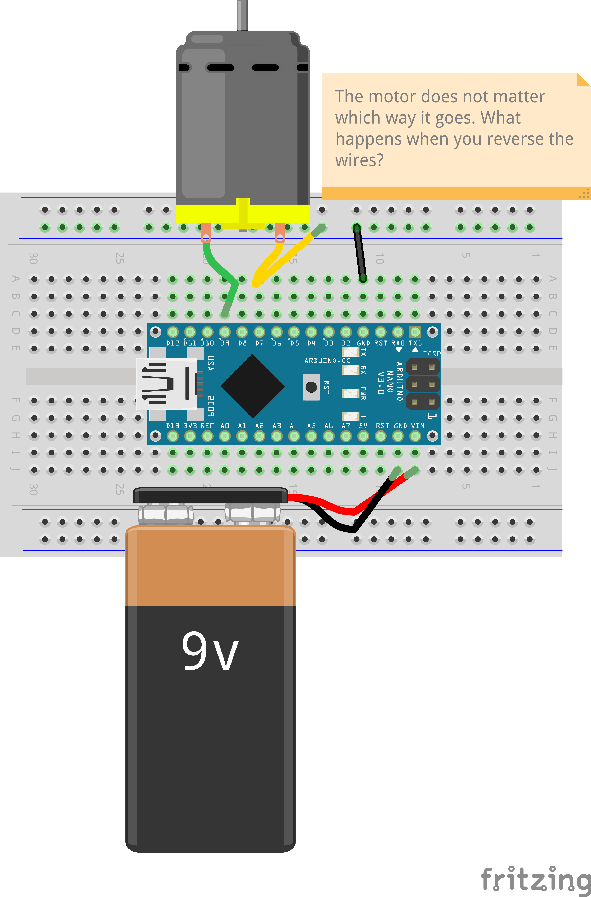
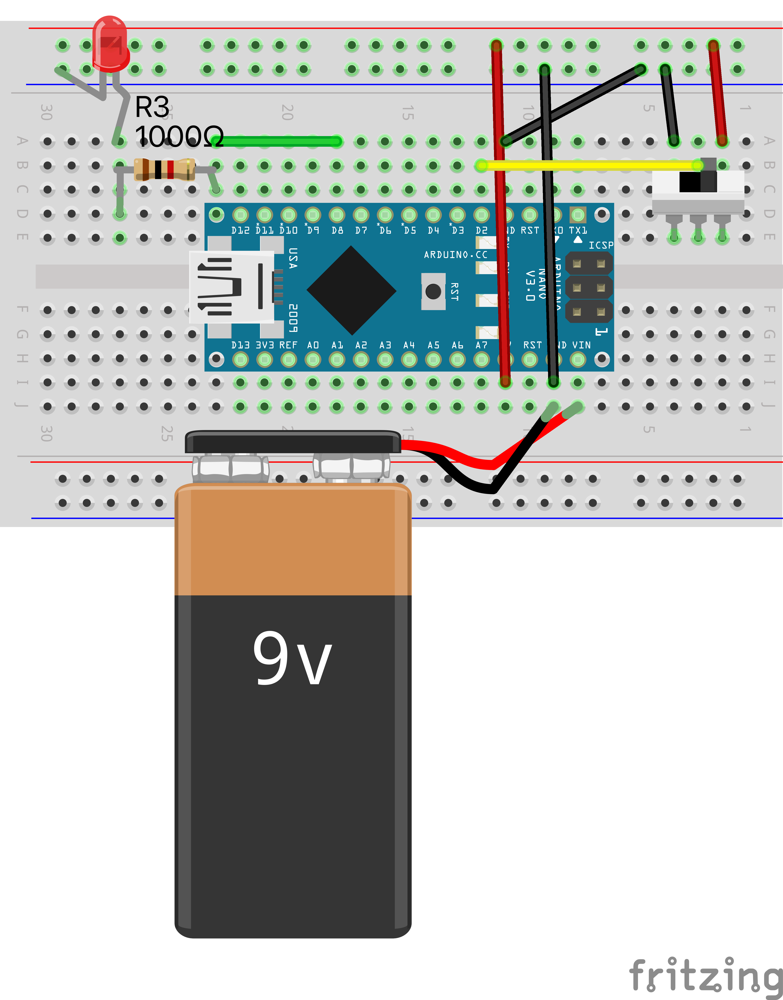
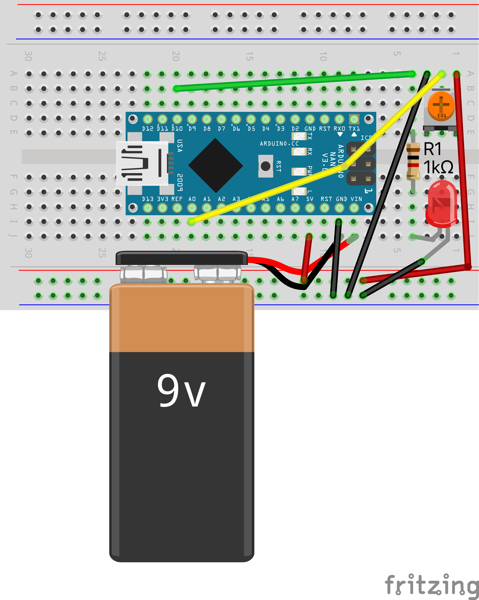
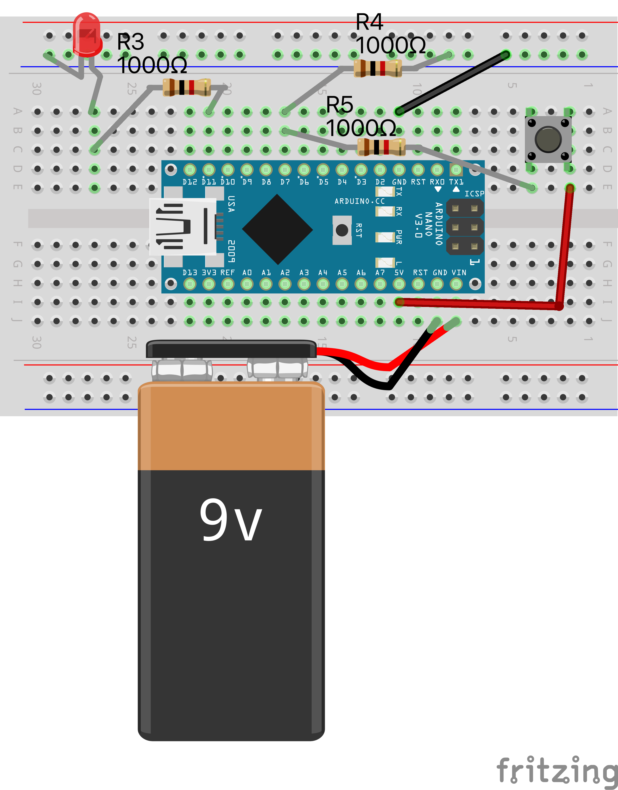
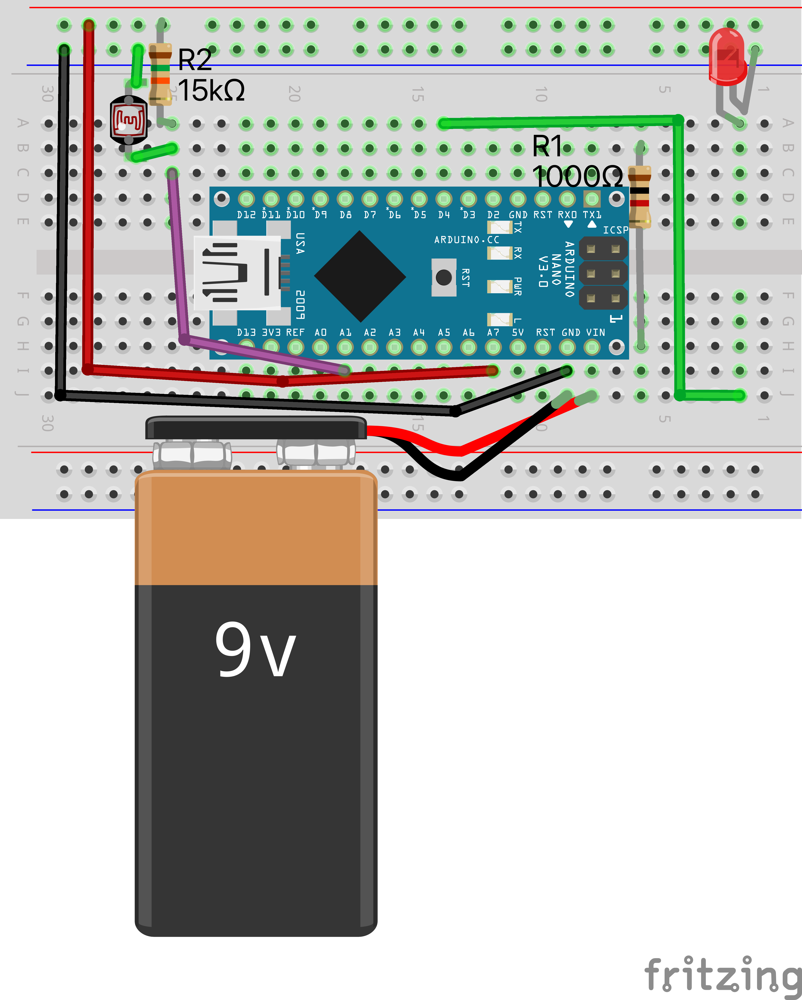
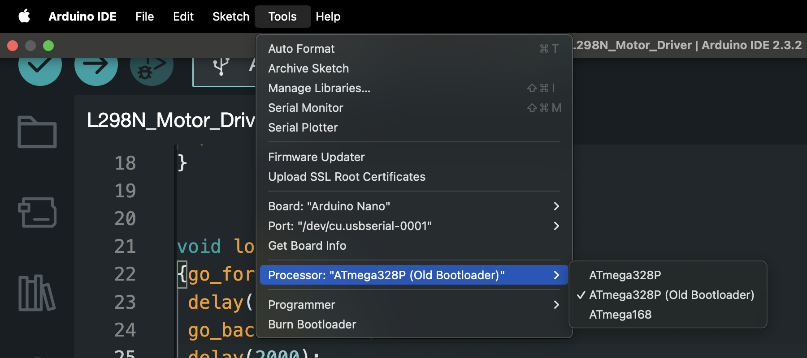
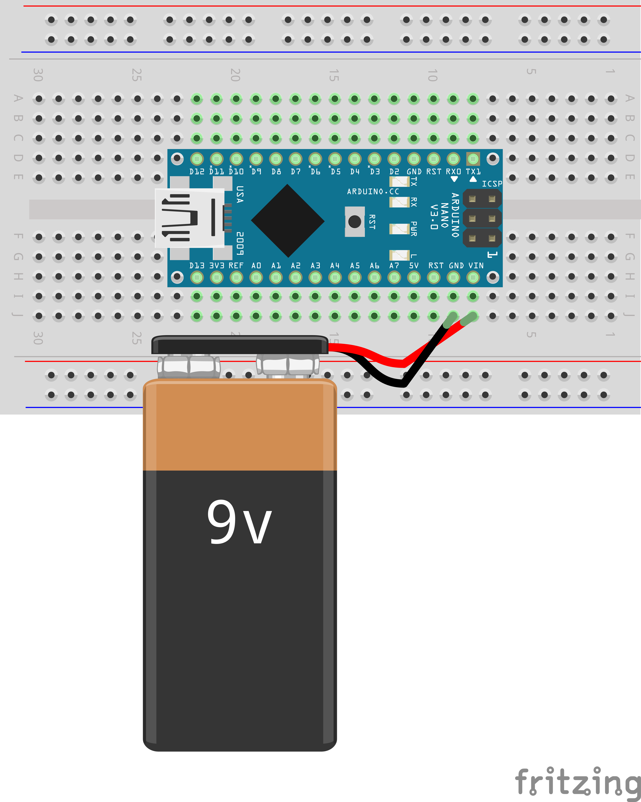

# ArduinoNanoCircuit Unplugged Lab

## Overview

Welcome! After setting up your ArduinoNanoCircuit Unplugged Lab, this Arduino allows people to build circuits without needing a computer or the knowledge of how to code. This guide provides everything you need to get started with hands-on Arduino Nano projects where you can program and go. **After coding the Arduino Nanos no computer is necessary!** This project only needs a 9v battery or USB to an outlet to work. You'll learn how to build and program circuits involving LEDs, motors, potentiometers, photoresistors, slide switches, and push buttons.

## Materials List

Here's what you'll need for the activities:

- Arduino Nano (with USB cable)
- LEDs (various colors)
- Resistors (220Ω, 10kΩ)
- Breadboard (small size or larger)
- Jumper wires (Female to female)
- DC motor
- Potentiometers (10kΩ)
- Photoresistors (LDR)
- Slide switches
- Push buttons
- 9V battery (with snap connector) or USB power bank or USB wall outlet cube

## Activities Outline

1. Blinking LED

   - Connect an LED to `pin 3`.
   - Blinks the LED on and off.
   

1. Fading LED

   - Connect an LED to `pin 5`.
   - Gradually change the LED brightness.
   

1. DC Motor

   - Connect a DC motor to `pin 9`.
   - Controls the motor speed and direction.
   

1. Slide Switch Control

   - Connect a slide switch to `pin 2`.
   - Connect an LED to `pin 8`.
   - Toggle an LED with the switch.
      

1. Potentiometer Control

   - Connect a potentiometer to `A0`.
   - Connect an LED to `pin 10`.
   - Adjusts LED brightness with the potentiometer.
   

1. Push Button Control

   - Connect a push button to `pin 7`.
   - Connect an LED to `pin 11`.
   - Controls an LED with the button.
   

1. Photoresistor Control

   - Connect a photoresistor to `A1`.
   - Connect an LED to `pin 4`.
   - Turns on an LED based on light levels near photoresistor.
   

## Programming the Arduino Nano

Follow these steps to program your Arduino Nano:

1. **Install Arduino IDE**:

   - Download and install the Arduino IDE from the [official website](https://www.arduino.cc/en/software).

1. **Select the Correct Board and Port**:

   - Open the Arduino IDE.
   - Go to `Tools > Board` and select `Arduino Nano`.
   - Go to `Tools > Port` and select the appropriate COM port.

1. **Use the Old Bootloader**:

   - Some Arduino Nanos require the old bootloader to upload sketches faster. To select the old bootloader:
   - Go to `Tools > Processor` and select `ATmega328P (Old Bootloader)`.

   

1. **Upload the Code**:

   - Write or paste your code in the Arduino IDE.
   - Click the upload button (right arrow) to upload the code to your Arduino Nano.

1. **For Instructors: Connect Your Initial Components**:

   - I recommend attaching the Arduino Nanos to the breadboards before giving them to kids as you have to use quite a bit of force to push them down. It also helps if you can put on the battery snap for them beforehand. Here is a diagram of what it looked like when we gave them to students.
   

1. **Run the Activities**:

   - Refer to the wiring diagrams and connect your components to the breadboard and Arduino Nano as described in the activities.
   - Once the code is uploaded you can start to build and play with the circuits.

## Conclusion

With the ArduinoNanoCircuit Unplugged Lab, students gain practical experience in building circuits without needing a computer or the knowledge of how to code Build with peace knowing you won't have to troubleshoot software issues. Enjoy your journey into the world of electronics and Arduino programming!
